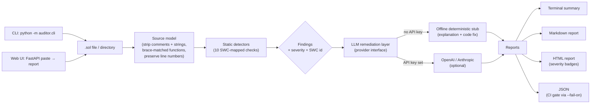

# solidity-audit-ai

> A fast, **rule-based** Solidity static analyzer: 10 [SWC](https://swcregistry.io)-mapped
> detectors flag common, high-impact vulnerabilities in seconds, with **no Solidity toolchain
> and no source ever leaving your machine** — plus an **optional** LLM layer that turns each
> finding into a plain-English explanation and a code fix.

> **How the "AI" part works (so nothing is oversold):** detection is *deterministic and
> rule-based* — there is no model in the loop for finding bugs. The optional LLM only writes
> the remediation prose, and the public demo (and any keyless run) uses a **deterministic
> offline engine**, not a live model. Set an API key to swap in OpenAI/Anthropic for the
> remediation text.

[](https://github.com/LaelaZorana/solidity-audit-ai/actions/workflows/ci.yml)


## The problem

Smart-contract bugs are uniquely unforgiving: code is immutable once deployed and
holds funds directly, so a single missed reentrancy or access-control gap can
cost millions. Professional audits are slow and expensive, and most existing
static tools either need a full Solidity toolchain (solc, a node, a compile step)
or dump raw findings with no actionable fix. Developers want a fast, local
pre-audit they can run on every commit that says *what is wrong, where, why it
matters, and exactly how to fix it* — without shipping their source to a SaaS.

## What it does

`solidity-audit-ai` runs a suite of **pure-Python static detectors** over a
`.sol` file or directory, maps each finding to its [SWC](https://swcregistry.io)
class and a severity, and then passes every finding through an **optional LLM
remediation layer** — a deterministic offline engine by default — that produces a
plain-English explanation and a concrete code fix. It emits a terminal summary, a Markdown report, a self-contained HTML report
with severity badges, and JSON for CI gating. It runs **fully offline** — the
static analysis needs zero third-party dependencies, and the LLM layer falls back
to a deterministic offline engine when no API key is set.



## Results / impact

Running the auditor on the bundled fixtures (`make demo`) — 8 intentionally
vulnerable contracts and 4 safe counterparts — produces:

**Vulnerable fixtures (`samples/vulnerable/`, 8 files): 23 findings**

| Severity | Count | Representative finding |
|---|---|---|
| Critical | 2 | Reentrancy (SWC-107), Unprotected `selfdestruct` (SWC-106) |
| High | 9 | `tx.origin` auth (SWC-115), missing access control (SWC-105), untrusted `delegatecall` (SWC-112) |
| Medium | 4 | Unchecked low-level call (SWC-104), weak randomness (SWC-120), pre-0.8 overflow (SWC-101) |
| Low | 0 | — |
| Informational | 8 | Floating pragma (SWC-103) |

**Safe fixtures (`samples/safe/`, 4 files): 0 findings** — every detector stays
silent on the hardened counterpart, demonstrating a low false-positive rate.

The test suite asserts both directions for each detector: it **fires** on the
vulnerable fixture and does **not** false-positive on the safe one.

## Quickstart

No dependencies are required for the core auditor — it runs on the Python
standard library alone.

```bash
# Clone, then from the repo root:
python -m auditor.cli samples/vulnerable          # audit a directory
python -m auditor.cli samples/vulnerable/Reentrancy.sol   # audit one file

# Write reports:
python -m auditor.cli samples --md report.md --html report.html

# One-shot demo (audits the samples and opens the HTML report):
make demo

# JSON output + CI gate (exit non-zero on High or worse):
python -m auditor.cli samples --format json --fail-on high
```

Run the tests (offline):

```bash
python -m pytest -q
```

Optional web UI — a polished **paste-a-contract** workbench (light/dark, Tailwind,
one-click sample contracts, findings rendered as severity-badged cards with a
summary headline). Runs fully offline; Tailwind is vendored, so no network is
needed:

```bash
pip install -r requirements.txt
make serve            # or: uvicorn auditor.webapp:app --port 8000
# open http://localhost:8000
```

By default the AI remediation uses a deterministic **offline** engine. To use a
real model instead, set an API key (entirely optional):

```bash
export OPENAI_API_KEY=...        # or ANTHROPIC_API_KEY=...
python -m auditor.cli samples --provider openai
```

## Tech stack

- **Python 3.9+**, standard library only for the core (analysis engine,
  detectors, reports, CLI) — no solc, no node, no toolchain.
- **Custom lightweight source model** — comment/string-stripping that preserves
  line numbers + brace-matched function extraction, so detectors never fire on
  commented-out or stringified code.
- **Pluggable LLM provider interface** — deterministic offline stub by default;
  optional OpenAI / Anthropic backends that degrade gracefully to the stub.
- **FastAPI + Uvicorn** for the optional web UI.
- **pytest** for tests, **ruff** for linting, **GitHub Actions** for CI
  (matrix across Python 3.9 / 3.11 / 3.12 + a Docker build), **Docker** for
  containerized deployment.
- **Optional Slither bridge** — if `slither` is installed it is merged in; if
  not, it is a silent no-op.

## Deploy

**Container (recommended).** The image serves the web UI on port 8000 and can
also run the CLI:

```bash
docker build -t solidity-audit-ai .
docker run --rm -p 8000:8000 solidity-audit-ai          # web UI
# CLI against a mounted directory of contracts:
docker run --rm -v "$PWD/contracts:/data" solidity-audit-ai \
    python -m auditor.cli /data --format json
```

The container runs as a non-root user and ships a `/health` healthcheck, so it
drops straight into any container platform (Fly.io, Render, Cloud Run, ECS,
Kubernetes). No secrets are required — set `OPENAI_API_KEY` / `ANTHROPIC_API_KEY`
only if you want live LLM remediation.

**CI integration.** Add a gate to any pipeline:

```bash
python -m auditor.cli contracts/ --format json --fail-on high
```

## Detectors

Each detector maps to an [SWC Registry](https://swcregistry.io) class.

| Vulnerability class | SWC ID | Severity | Detector id |
|---|---|---|---|
| Reentrancy: state change after external call | SWC-107 | Critical | `reentrancy` |
| Unprotected `selfdestruct` | SWC-106 | Critical | `unprotected-selfdestruct` |
| Authentication via `tx.origin` | SWC-115 | High | `tx-origin-auth` |
| Missing access control on sensitive function | SWC-105 | High | `missing-access-control` |
| `delegatecall` to untrusted / user-controlled target | SWC-112 | High | `delegatecall-untrusted` |
| Unchecked low-level call return value | SWC-104 | Medium | `unchecked-call` |
| Weak randomness from block properties | SWC-120 | Medium | `weak-randomness` |
| Integer over/underflow risk (pre-0.8 / `unchecked`) | SWC-101 | Medium | `integer-overflow` |
| Floating / unlocked compiler pragma | SWC-103 | Informational | `floating-pragma` |
| Suspicious unary expression (`=+` typo) | SWC-129 | Low | `dangerous-unary` |

> Static heuristics are intentionally high-signal and dependency-free. This tool
> is a fast pre-audit, not a replacement for a professional manual review or a
> full symbolic-execution engine.

## Screenshots

> _Placeholders._ Generate them locally to drop in:
> - `docs/webui.png` — the paste-a-contract web UI (hero, code editor, one-click
>   samples, severity-summary tiles, findings cards). Run `make serve` and open
>   <http://localhost:8000>.
> - `docs/report.png` — the self-contained HTML report (severity headline +
>   stat tiles + per-finding remediation). Run `make demo` (writes `report.html`).
> - `docs/terminal.png` — the colorized CLI summary (`python -m auditor.cli samples`).

---

MIT licensed. Copyright (c) 2026 Laela Zorana.
